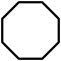
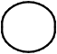
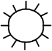
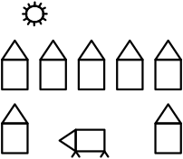
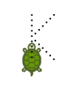
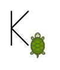
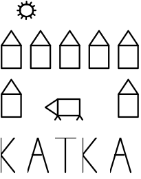

# Task 1 (lesson 2) – The Turtle Žofka

Create each part of the task as a separate commit. If you later discover any errors in the code, no problem, commit the fix as another commit. 
If you want to back up your work continuously, after committing, also push, which will upload all unpushed commits to GitHub.

## Part 1
Create the method drawPiglet() that draws a piglet as shown in the picture. As a bonus, you can also draw the piglet's tail. 
Call this method from the start method in the MainProgram class to actually draw the piglet into the application window.

[piglet image](obrazky/ukol01-prasatko.svg)

## Part 2
Continue with the project and draw several shapes according to the pictures below. 
Create a special method for each image (which you will call from MainProgram) and optionally call other methods inside it. 
Be careful not to overlap the images (including the piglet).

Note: The turtle cannot draw curved lines. 
You can draw a circle and similar shapes by drawing a short line (e.g., 5 pixels), then turning a small angle (e.g., 20°), and repeating this n times (e.g., 18 times).

## Part 3
Draw a composition according to the image below. Use the methods you have already written for this. 
Comment out the drawing of images from parts 1 and 2 in the code so that only the final image is drawn into the window.

Leave space above or below the image for your name - Part 4.

## Part 4
Teach the turtle to draw the letters in your name and draw your first name. 
Focus on reusability in this part. Create a method for each letter (e.g., drawA(), drawB(), ... - only the letters you have in your name are necessary). 
Start each letter from the bottom left (as if on the bottom line of the letter) and end at the bottom right (on the bottom line of the letter) 
at the position for the next letter (after a space). If you maintain this style consistently in each method, the letters can be concatenated in any order.

Consider the letter "K" for demonstration. Dashed lines indicate how the turtle will draw it. 
The turtle is currently in the default position (and has not yet drawn the letter):

The turtle gradually draws the letter and ends up in this position:

## Submission of the task
At the end, you will have an application that draws an image, with your name above or below it. 
The resulting image drawn in the application might look like this:

Once everything is done, verified, and you have committed the final change, push it to GitHub - this will send all your commits to GitHub. 
Check through the GitHub web interface (via the browser) to ensure that all your changes are uploaded there. 
Finally, insert the link to your repository into the homework submission system at  https://moje.czechitas.cz.

